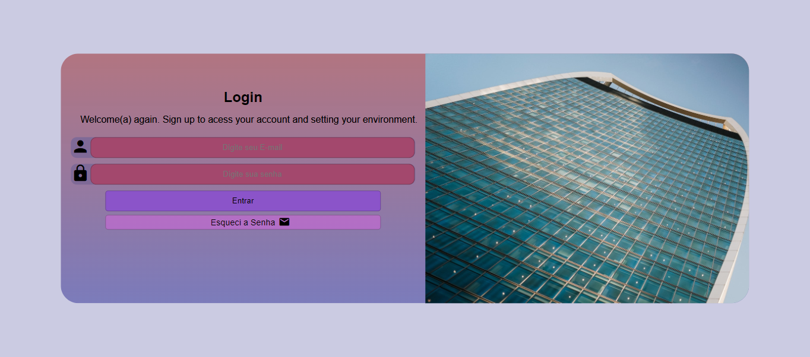

# Tela de Login Responsiva

Este projeto consiste em uma tela de login simples e responsiva, desenvolvida como parte de um desafio em um curso. A interface é projetada para ser amigável e adaptável a diferentes tamanhos de tela, proporcionando uma experiência consistente em dispositivos variados.

## Demonstração

## Tecnologias Utilizadas

- HTML5
- CSS3

## Funcionalidades

- **Responsividade:** A interface é projetada para ser utilizada em uma variedade de dispositivos, desde telas grandes de desktop até dispositivos móveis.

## Como Utilizar

1. Clone este repositório: `git clone https://github.com/johanpq/tela-de-login.git`
2. Abra o arquivo `index.html` em seu navegador web.

## Demonstração Online

Acesse a [demo online](https://johanpq.github.io/tela-de-login/) para experimentar o projeto ao vivo.

